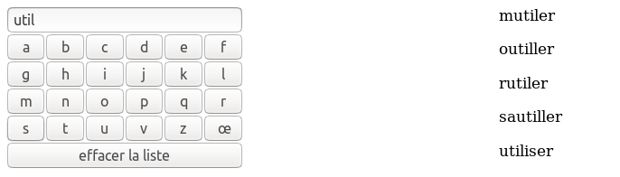
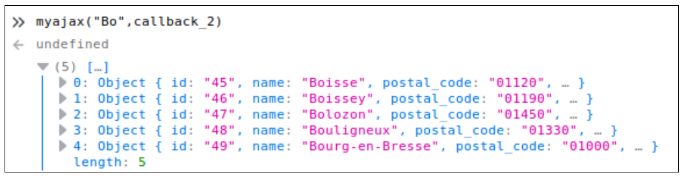

#  Prog web client riche - JavaScript 

### IUT Montpellier-Sète – Département Informatique

## TD5
#### _Thème : asynchronisme en JavaScript, AJAX, formulaire autocomplétif_

Cliquez sur le lien ci-dessous pour faire, dans un dossier public_html/JS/TD1, votre fork privé du TD1 (**attention, pas de fork à la main !**):

https://classroom.github.com/a/-2bRfmh3

la version [pdf](ressources/td5.pdf)

## INTRODUCTION

Dans ce TD, on aborde l’aspect asynchrone de JavaScript, qui permettra de modifier le contenu d’un élément d’autocomplétion, représenté par la balise html `
`, à chaque modification du champ de saisie `<input id="inpcity">`. 

Cet élément `
` fournira alors une liste de villes dont le nom commence par les lettres insérées dans `<input id="inpcity">`.

Voir ci-dessous :

   

	
Le contenu cet élément `
` est alimenté par le résultat (après traitement) d’une requête de type **AJAX** sur une base de données.

La fin du TD est consacrée à une fonctionnalité d’actualisation de l’élément `<select id="country">` (sélecteur du pays) par changement de l’autre élément `<select id="continent">` (sélection du continent), ainsi qu'à diverses fonctionnalités complémentaires liées à la div `<input id="inpcity">`.

Contrairement à la liste de villes (plus de 36000 entrées, ce qui justifie le stockage sur base de données), la liste de pays par continent est de taille raisonnable et sera gérée en local par JavaScript, par un fichier `countries.js` qui affecte une variable globale `countries`.  

Vous mettrez en place un contexte web dans votre `public_html` avec les fichiers :

- completion.css,
- loading.gif qui sert plus tard,
- cityAutoComplete.js à compléter,
- countries.js qui sert plus tard,
- la base de cityRequest.php,
- Conf.php, Model.php, result.php,
- completion.html

Le fichier `cityAutoComplete.js` est à construire complètement.

## EXERCICE 1 – Ébauche du fichier cityAutoComplete.js

1. Dans le fichier `cityAutoComplete.js`, codez la fonction `afficheVilles` qui prend en paramètre un tableau de villes comme par exemple `["Bordeaux","Toulouse","Montpellier","Nice"]` et dont l’effet est de remplir le `
` avec un paragraphe par nom de villes comme ci-dessous

   		

   			
Bordeaux

   			
Toulouse

   			
Montpellier

   			
Nice

   		

   Votre code utilisera obligatoirement la méthode `appendChild` pour chaque `
` à créer. Insérez votre fichier `cityAutoComplete.js` dans le `html`, puis testez votre fonction avec le tableau ci-dessus en le déclarant dans une variable `tableau` et en lançant `afficheVilles(tableau)` dans la console;

   		let tableau = ["Bordeaux","Toulouse","Montpellier","Nice"];
   		afficheVilles(tableau);

   Faites un deuxième appel de la fonction avec le même tableau. Vous devez constater qu’il peut être malin de commencer par vider le contenu de la balise `
`. 

2. Créez une fonction `videVilles` qui vide l’élément `
`. Cette fonction sera appelée par `afficheVilles`. Vous utiliserez deux approches différentes : 

	- une méthode qui utilise `removeChild`,
	- une méthode plus basique qui remet le `innerHTML` de `
` à `""`.

   Remarque : on ne dit pas que les méthodes `appendChild` et `removeChild` sont meilleures qu’un "bricolage" du `innerHTML`, par contre elles sont plus dans la logique objet, et seront plus simples à utiliser si l’arborescence à ajouter/modifier se complique. Notre arborescence de `
` reste ici simple.

## EXERCICE 2 – La page de requête cityRequest.php

Cette page côté serveur est déjà codée pour vous permettre de lancer une requête de type `SELECT` sur la base de données. Elle incorpore un fichier `Model.php` qui incorpore lui-même un fichier `Conf.php`. Ce fichier `Model.php` vous propose une méthode `static selectByName` qui permettra de récupérer les 5 premières villes dont le nom commence comme la chaîne de caractères passée en paramètre à cette méthode (voir le code).

Les deux classes `Conf` et `Model` ont été abordées au S3 et vous n’avez pas à y toucher (sauf si vous voulez changer les paramètres de connexion pour utiliser votre propre base de données, avec le fichier `cities.sql` du dossier `src`).

Vous n’interviendrez que sur les quelques lignes du fichier `cityRequest.php`.

Ce fichier sera exécuté au moyen d’url du type `cityRequest.php?city=Bo`

Le paramètre `city` permettra d’utiliser `selectByName($name)`, avec la bonne valeur pour le paramètre `$name`. Par exemple, l’url `cityRequest.php?city=Bo` permettra de lancer, par la fonction `selectByName`, la requête `SQL` suivante :

		SELECT * FROM cities WHERE name LIKE 'Bo%' LIMIT 5

1. Complétez la page `cityRequest.php` pour qu’elle suive les étapes suivantes :

+ extraire le name passé en `GET` dans l’url ;

+ appeler la fonction `selectByName` déjà codée et stocker le résultat dans une variable `$res` ;

+ produire un `echo json_encode` de cette variable. L’affichage produit se fera donc en format `JSON` facilement exploitable par JavaScript.

2. Testez ensuite le bon fonctionnement de la page en appelant des url du type `cityRequest.php?city=Mo` ou `cityRequest.php?city=Toul`. Vous devez voir dans le navigateur un affichage brut du résultat de la requête SQL.

## EXERCICE 3 – Requête asynchrone

### Un peu de technique

Les navigateurs modernes fournissent une interface JavaScript nommée `XMLHttpRequest` (abr. XHR) qui permet de lancer des requêtes HTTP de manière asynchrone, c’est-à-dire sans bloquer la page web courante. 

L’ensemble des technologies autour des pages web asynchrones s’appelle `AJAX` (_Asynchronous Javascript And Xml_). 

Voici le squelette d’une requête `AJAX` :

		function myajax(stringCity) {
			let url = "php/cityRequest.php?city=" + stringCity
			let requete = new XMLHttpRequest();
			requete.open("GET", url, true);
			requete.addEventListener("load", function () {
				console.log(requete);
			});
			requete.send(null);
		}

La fonction `myajax` :

+ gère un paramètre `stringCity` qui est une chaîne de caractères (ce sera celle qu’on écrira dans la balise `<input id="inpcity">`);
+ crée une url pour `cityRequest.php`, construite à partir du paramètre `stringCity`;
+ crée un objet `XMLHttpRequest` nommé `requete`;
+ ouvre cette requête avec la méthode `open` qui donne le type de requête HTTP à effectuer (ici `GET`), l’URL de la page demandée et le troisième argument (`true`) signifie que la requête doit être asynchrone.
+ met cet objet `requete` en écoute de l’événement `load`, ce qui signifie que l’objet `requete` attendra la fin du chargement des données commandées à la base de données, pour lancer la fonction déclarée de manière anonyme et dont la modeste mission est ici d’afficher l’objet `requete` dans la console).
+ lance la requête par la méthode `send`. Le paramètre `null` est lié au fait que la méthode est `GET`. Si c’était `POST`, on aurait comme paramètre une chaîne de caractères annonçant les paires «`nom=valeur`», c’est-à-dire ici «`city=…`»

Le principe d’une requête asynchrone est qu’elle ne bloque pas l’exécution du JavaScript le temps que le serveur renvoie sa réponse. 

La fonction anonyme, qui ne fait qu’afficher l’objet requete dans la console, est appelée fonction **callback**. Elle sera appelée lorsque le serveur aura retourné ses informations.

Elle a pour mission **le traitement de la réponse du serveur**. Bien entendu, au final, cette fonction _callback_ aura pour mission de remplir le contenu de la balise `
`.

C’est ce que nous allons structurer, en plusieurs étapes. Comme nous allons construire plusieurs versions de la fonction `callback`, nous allons plutôt utiliser ce code plus générique :

		function myajax(stringCity,callback) {
			var url = "php/cityRequest.php?city=" + stringCity;
			var requete = new XMLHttpRequest();
			requete.open("GET", url, true);
			requete.addEventListener("load", function () {
				callback(requete);
			});
			requete.send(null);
		}

Dans cette version de `myajax`, on passera en deuxième paramètre le nom de la fonction qu’on aura choisie pour jouer le rôle du callback. Ainsi, pour avoir l’équivalent du premier code, on pourrait avoir définir une fonction `callback_1` de la façon suivante :

		function callback_1(req) {
			console.log(req);
		}

Et on pourrait utiliser par exemple un appel `myajax("Bo",callback_1);`

### écriture de quelques versions du callback

1. Complétez votre fichier `cityAutocomplete.js` avec le code des deux cadres précédents. Placez la ligne d’insertion du script dans le `head` de la page.

Nouveauté : ajoutez l’attribut `defer` à `

2. Lancez dans la console la commande `myajax("Bo",callback_1);`. Vous devez voir dans la console un descriptif complet de l’objet `requete`, avec notamment son attribut `responseText`.

3. Lancez d’autres commandes similaires en changeant le premier argument.

4. Écrivez une fonction `callback_2` qui, au lieu d’afficher dans la console l’objet XHR, comme le faisait `callback_1`, affichera un `JSON.parse` de l’attribut `responseText` de `requete`. Quel est l’effet de `JSON.parse` ? 

5. Testez ce `callback_2` en console avec la commande `myajax("Bo",callback_2);`

   Vous devriez obtenir un résultat comme ci-dessous

   

6. Créez une fonction `callback_3` qui transforme encore le résultat précédent pour créer un tableau contenant l’attribut `name` de chacun des objets. Ainsi, quand on lance la commande `myajax("Bo",callback_3)` on doit ontenir dans la console :

   

7. Créez enfin le callback final `callback_4` qui produit le même tableau que `callback_3`, et qui affiche son contenu (par l’intermédiaire de la fonction `afficheVilles`) dans la balise `
`.

8. Testez votre fonction `callback_4` en appelant `myajax` à partir de la console avec des chaînes de caractères diverses en premier paramètre.

9. Créez enfin, toujours dans le fichier `cityAutocomplete.js`, une fonction `cityRequest` qui prend en paramètre une chaîne de caractères. Grâce à cette fonction, l’instruction `cityRequest('Toul')` sera exactement équivalente à l’instruction `myajax("Toul",callback_4)`.

## Exercice 4 – premiers gestionnaires d’événements

1. Munissez le champ `<input id="inpcity">` d’un écouteur d’événement, associé à l’événement `input` (qui est lancé à chaque modification du contenu d’un `<input>`). La fonction appelée sera déclarée de façon anonyme, et son action sera d’appeler la fonction `cityRequest`, avec comme paramètre la valeur de la balise `<input id="inpcity">`. 

   Ainsi, chaque modification de ce champ met à jour le contenu de la balise `
`. On y est presque… 

2. Munissez la balise `
` d’un écouteur d’événement, associé à l’événement `click`. Le clic sur un des paragraphes composant la balise `
` aura le comportement intuitif attendu :

	- remplir `<input id="inpcity">` avec le contenu du paragraphe cliqué;
	- vider `
`

   Pour cela vous utiliserez `event.target` qui permet de savoir quel paragraphe est la cible de l’événement `click`.

	A ce stade votre champ d’autocomplétion est opérationnel.

## EXERCICE 5 – Les deux sélecteurs

Les deux sélecteurs `<select id="continent">` et `<select id="country">` vont fonctionner indépendamment du champ d’autocomplétion. Le sélecteur de continents sera chargé dès le début, et le contenu du sélecteur de pays devra s’actualiser au changement de la valeur du sélecteur de continents. La liste des pays et des continents auxquels ils appartiennent se trouve dans le fichier `countries.js`. 

### Le sélecteur de continents

1. Insérez, au niveau du `head` de `completion.html`, le fichier `countries.js` qui permet d’accéder à la variable `countries`. Attention d’insérer ce fichier avant le précédent. Réutilisez l’attribut `defer`.

2. Créez, dans `cityAutocomplete.js`, une fonction `chargerSelecteurContinents` basée sur `appendChild` et qui permet de structurer le sélecteur de continents en lui ajoutant des enfants `<option>...</option>`. Chacune de ces enfants aura pour `innerHTML` l’une des clés qu’on obtient par la méthode `Object.keys` appliquée à `countries`. 

   Vous aurez donc à utiliser le contenu de `Object.keys(countries)`.

   Vous ajouterez un enfant de la forme `<option selected disabled>choisissez un continent</option>`. Il faudra pour cela agir sur les attributs `selected` et `disabled` de l’élément créé (les mettre à la valeur `true`).

   Testez cette fonction dans la console et vérifiez que le sélecteur de continents se remplit bien.

3. Faites en sorte que ce sélecteur se remplisse au chargement de la page. Pour cela, votre fonction `chargerSelecteurContinents` sera associée à l’événement `DOMContentLoaded` dans un écouteur d’événement de l’objet document.

### Le sélecteur de pays

4. Lors d’un changement de valeur du sélecteur de continents, le sélecteur de pays doit proposer les pays du continent sélectionné.

   Créez, dans `cityAutocomplete.js`, une fonction `chargerSelecteurPays` qui permet de construire les fils de la balise `<select id="country">` : 

	+ récupérer la valeur du sélecteur de continents ;
	+ récupérer, dans `countries`, le tableau correspondant à cette valeur ;
	+ créer, pour chaque entrée du tableau, une ligne du sélecteur de pays au moyen de la méthode `appendChild` (assez similaire au sélecteur de continents).
	+ ne pas oublier la ligne `<option selected disabled>choisissez un pays</option>`

5. Testez votre fonction dans la console. Vous ferez bien attention au fait que le sélecteur de pays doit être réinitialisé à chaque fois.

6. Munissez le sélecteur de continents d’un écouteur d’événement pour que chaque changement de ce sélecteur lance la fonction `chargerSelecteurPays`.

## EXERCICE 6 – Compléments divers

### Détail css

Vous corrigerez un petit détail : Il y a un petit carré gris qui apparaît quand `
` est vide. C’est sa `border,` de largeur `1px`. Faites en sorte de corriger, au niveau du JavaScript, l’attribut `style.borderWidth` de cette `div` en fonction de son contenu, pour ne pas avoir ce défaut du petit carré gris. 

### Limitation de l’autocomplétion

Modifiez légèrement la fonction associée à l’événement input pour que l’auto-complétion n’opère que si le contenu du champ `Ville` contient au moins deux caractères.

### Signal de chargement

Lorsqu’un chargement est en cours, nous pouvons le signaler à l’utilisateur pour qu’il patiente le temps nécessaire. Dans notre cas, nous afficherons le GIF de chargement `loading.gif` fourni dans l’archive .zip pendant le délai de réponse du serveur.

1. Modifiez `myajax` pour que la fonction prenne en paramètres supplémentaires deux fonctions `startLoadingAction` et `endLoadingAction`.

   + La première fonction sera lancée dès le lancement de la requête. La deuxième sera lancée dès la réception de la réponse. On aura donc des appels de la forme

		myajax("Bo",callback,action_debut,action_fin)

   + La première fonction sera lancée en première instruction de `myajax`, et la deuxième sera lancée après le `callback` de l’écouteur d’événement `load`.

2. Dans la fonction `cityRequest`, modifiez l’appel à `myajax` pour ajouter deux nouveaux paramètres : ce seront deux fonctions anonymes :

	+ la première, qui jouera le rôle de `startLoadingAction`, rendra visible le GIF de chargement ;
	+ la deuxième, qui jouera le rôle de `endLoadingAction`, lui redonnera une visibilité `hidden`.

3. Pour que le comportement soit visible, truquez en ajoutant une temporisation de 1 seconde dans `cityRequest.php`

   Note : l’instruction PHP : `sleep(1);`

## Exercice 7 – Utilisation des touches ↓ , ↑ et ↵

Les touches haut et bas servent habituellement à se déplacer dans la liste des suggestions, et la touche `ENTER` à valider l’élément courant. L’utilisation de ces touches entraîne une mise à jour du champ texte où s’inscrit le nom de la ville. Programmez ces comportements.
=======
## TD4
#### _Thème : l'objet XMLHttpRequest, requêtes AJAX_

Cliquez sur le lien ci-dessous pour faire, dans un dossier public_html/JS/TD4, votre fork privé du TD4 (**attention, pas de fork à la main !**):

https://classroom.github.com/a/kOejRRzk

la version [pdf](ressources/td4.pdf)

## INTRODUCTION

Dans ce TD, nous allons découvrir et manipuler un objet très important en JavaScript : l’objet **XMLHttpRequest**.

Cet objet est une interface JavaScript permettant de communiquer avec un serveur pour recueillir des données.

Il permet par exemple de lancer des requêtes sur une base de données, mais aussi, plus simplement, de recueillir des données affichées par un simple `echo` PHP. 

Vous utiliserez le format `JSON`, qui offre un format très lisible et compréhensible d’échange de données, et que vous pouvez utiliser en **PHP** et en **JavaScript**. Ce format sera utilisé simplement au travers de fonctions PHP (`json_encode`) et JS (`JSON.parse`).

## EXERCICE 1 – premier exemple simple

1. Ecrivez un fichier `coucou.php` dont le seul objectif est d’afficher « coucou », au niveau de votre dossier `public_html/TD5`.

		<?php echo "coucou"; ?>

2. De votre navigateur, faites une requête `http` sur la page `coucou.php` puis ouvrez la console JavaScript (F12, onglet console).

3. Entrez la commande suivante

		let xhr = new XMLHttpRequest();

   Cette commande instancie un nouvel objet JavaScript de type `XMLHttRequest`, stocké dans la variable `xhr`.

4. Cet objet sert à lancer des requêtes au serveur. Nous allons lancer, grâce à la variable `xhr`, une requête à la page `coucou.php`. Pour cela, entrez les commandes suivantes dans la console :

		xhr.readyState;					// état de xhr
		xhr.responseText;					// contenu texte de la réponse
		xhr.open("GET","votre url vers coucou.php",true);	// ouverture de la requête
		xhr.readyState;					// état de xhr
		xhr.responseText;					// contenu texte de la réponse
		xhr.send(null);					// envoi de la requête
		xhr.readyState;					// état de xhr
		xhr.responseText;					// contenu texte de la réponse

	+ `readyState` donne l’état d’avancement de la requête, voir cours plus tard
	  (valeurs de 0 à 4)
	+ `responseText` donne l’état actuel de la réponse textuelle à la requête
	+ la méthode `open` donne à `xhr` tous les éléments pour lancer la requête.
	+ la méthode `send` envoie la requête (le paramètre `null` vient du fait que
 	  la méthode est GET, voir plus tard dans le cours).
	+ le paramètre `true` de la méthode `open` sera détaillé dans le cours.
	
5. Commentez l’évolution des attributs `readystate` et `responseText`.

## EXERCICE 2 – Utilisation de json_encode (PHP) et de JSON.parse (JS)

1. Examinez le contenu du fichier `src/haddock_v1.php` puis appelez-le dans le navigateur. Vérifiez qu'à l'affichage, vous obtenez bien une chaîne de caractères correspondant à un tableau équivalent à celui stocké dans la variable `$haddock`.

2. comme dans le premier exemple, créez un objet `XMLHttpRequest` puis lancez les commandes suivantes :

		let xhr = new XMLHttpRequest();		
		xhr.open("GET","votre url vers haddock_v1.php",true);
		xhr.send(null);
		xhr.readyState;
		xhr.responseText;
		let resultat = xhr.responseText;
		resultat;
		let tab = JSON.parse(resultat);
		tab;

## EXERCICE 3 – Utilisation de json_encode (PHP) et de JSON.parse (JS)

1. Examinez le contenu du fichier `src/haddock_v2.php` puis appelez-le dans le navigateur. Vérifiez qu'à l'affichage, vous obtenez bien une chaîne de caractères correspondant à un tableau équivalent à celui stocké dans la variable `$haddock`.

2. comme dans le premier exemple, créez un objet `XMLHttpRequest` puis lancez les commandes suivantes :

		let xhr = new XMLHttpRequest();		
		xhr.open("GET","votre url vers haddock_v2.php",true);
		xhr.send(null);
		xhr.readyState;
		xhr.responseText;
		let resultat = xhr.responseText;
		resultat;
		let obj = JSON.parse(resultat);
		obj;

3. Remarques sur la variable `obj` ?

## EXERCICE 4 – chargement long d’un fichier texte

Il peut arriver que le chargement des données à recueillir soit assez long. Dans ce cas l’attribut `readystate` ne passe pas immédiatement à la valeur 4.

L’événement `load` traduit la fin du chargement des données. 

On va donc mettre l’objet `xhr` en état d’écoute de cet événement.

Voici les commandes : 

		let xhr = new XMLHttpRequest();		
		xhr.open("GET","un_certain_fichier.txt",true);
		xhr.addEventListener("load",function() {
			console.log("chargement terminé !!!");
		});
		xhr.send(null);
		let texte = xhr.responseText;
		texte.length;

remarque : évitez d’afficher directement dans la console la variable texte. Sa taille importante peut faire planter le navigateur...
		

### Détails : 

- on crée un objet `XMLHttpRequest`;
- on lui donne les éléments pour lancer la requête;
- on le met en écoute de l’événement `load`, et quand cet événement se produit, on lance une fonction anonyme qui affiche dans la console « chargement terminé » et on lance la requête.

Cette fonction lancée après la fin du chargement est habituellement appelée fonction **callback**. 

Vous allez mettre en œuvre ces commandes en chargeant divers fichiers txt de tailles variées (voir ces fichiers dans le dossier `src`) : 

+ mobydick.txt (environ 1,2 Mo)
+ bible.txt (environ 4,4 Mo)
+ bible2.txt (environ 45 Mo) obtenue par recopie du précédent

voyez-vous un délai pour le lancement de la fonction **callback** ?
>>>>>>> 6627c4b9751e397d427f72e5cf4daa876faae99f
